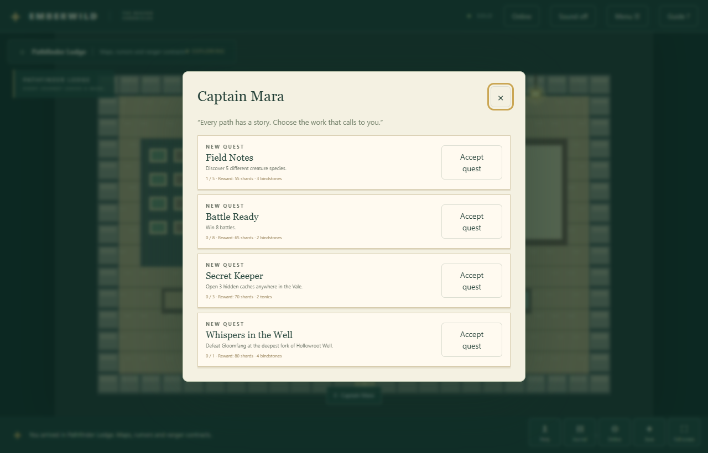
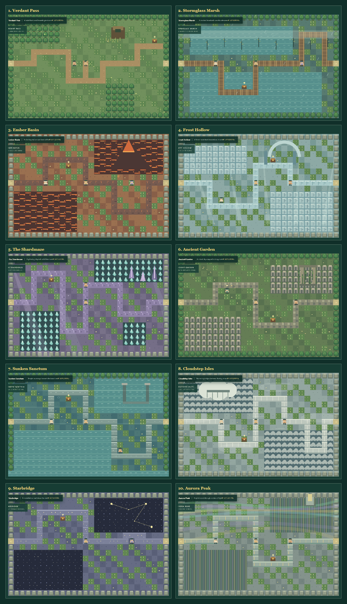

# Emberwild — The Beacon Chronicles

Emberwild is an original, open-source creature-catching RPG for desktop and mobile browsers. It has a complete five-crest story, 25 creatures, evolution, status-driven turn-based battles, 24 maps, enterable buildings, shops, a structured quest log, inventory rewards, living landscapes, regional procedural music and sound, local saves, and online co-op rooms.



## You do not need Codex

Codex was used to create the project, but it is not part of the game. Players only need a modern web browser. The multiplayer host only needs Node.js. You can upload, edit, deploy, and play Emberwild without opening Codex again.

Keep this folder or its ZIP as your backup. GitHub stores the source, and Render can run its multiplayer server. You can make small text edits with GitHub's web editor or use any code editor.

## Play locally

Install [Node.js](https://nodejs.org/) 18 or newer, open a terminal in this folder, and run:

```sh
node server.js
```

Open `http://localhost:8080`. That address works on your own computer. For friends on other networks, follow the GitHub and Render steps below.

## Put the multiplayer game online

The easiest setup uses a public GitHub repository for the files and Render for the live Node server. You do not need to type any code.

### Step 1: upload the game to GitHub

1. Sign in to [GitHub](https://github.com) and [create a new repository](https://github.com/new).
2. Name it `emberwild`, choose **Public**, and create it without adding a README.
3. Extract the supplied ZIP and open the extracted `emberwild` folder.
4. In the empty repository, choose **Add file → Upload files**.
5. Drag the **contents** of the folder into GitHub. `index.html`, `server.js`, `package.json`, and `render.yaml` must appear at the top level. Do not upload only the ZIP or place the files inside another folder.
6. Choose **Commit changes**.

Your source is now public and downloadable. Future edits committed to the repository can automatically redeploy the live game.

### Step 2: deploy the multiplayer server on Render

1. Create an account at [Render](https://render.com) and connect your GitHub account.
2. In the Render dashboard, choose **New → Blueprint**.
3. Select the `emberwild` repository. Render automatically reads `render.yaml` from the repository root.
4. Review the `emberwild` web service and choose **Deploy Blueprint**. No environment variables, database, build command, or package installation is needed.
5. Wait until the service says **Live**, then open its `https://...onrender.com` address.
6. Send that address to every player. Everyone must open the same Render link.

One player chooses **Join an online room → Create room** and shares the five-character code. Friends choose **Join room**, enter that code and a ranger name, and then appear in the same world. Players can use different computers or phones and different internet connections.

Render documents the same Blueprint flow in its [official Blueprint setup guide](https://render.com/docs/infrastructure-as-code). Free services currently sleep after 15 minutes without inbound traffic and can take about a minute to wake. Rooms and chat reset when the server restarts, while each player's RPG save remains in that device's browser. See [Render's current free-service limits](https://render.com/docs/free).

## Optional: solo game on GitHub Pages

GitHub Pages can host the solo game for free, but it cannot run the Node room server. After uploading the files:

1. Open the repository's **Settings → Pages**.
2. Under **Build and deployment**, choose **Deploy from a branch**.
3. Select the `main` branch and `/(root)` folder, then choose **Save**.
4. Wait for GitHub to show the site address, usually `https://YOUR-NAME.github.io/emberwild/`.

These are the current steps in GitHub's [official publishing-source guide](https://docs.github.com/en/pages/getting-started-with-github-pages/configuring-a-publishing-source-for-your-github-pages-site). Use the Render link when you want rooms, chat, and the shared raid.

## Online mode

- Private room codes for up to 20 connected players.
- Live player positions, names, colors, current regions, and companions.
- Campfire room chat.
- A shared Rift Wyrm raid that requires at least two connected players.
- Automatic reconnection after a page reload while the room exists.
- Separate local story progress and creature collections for every device.

The lightweight room server has no accounts, trading, competitive battles, global public chat, cloud story saves, or permanent database. Restarting the server clears rooms and chat. One player cannot overwrite another player's save.

## The RPG

- 24 maps: the original 20-region campaign plus the Pathfinder Lodge, Moonleaf Farm, Hollowroot Well and Rootbound Vault.
- A ten-region main expedition with individually shaped routes, regional terrain, major landmarks, side paths, and ten hidden supply caches.
- Animated atmosphere across all 17 outdoor maps: rain, snow, drifting leaves, lava embers, water ripples, crystal light, clouds, bubbles, shooting stars, auroras, fireflies, ocean foam, and mountain wind.
- Twenty-five discoverable species, 25 named abilities, three starter evolutions, five wardens, a two-phase regional boss, and a level-23 final trial.
- Eleven structured side quests with tracked objectives, rewards, a quest log, ranger levels and a categorized 15-item inventory.
- A complete starting-region adventure with new villagers, a lost explorer, hidden treasure, a branching dungeon, a miniboss gate and the Rootwarden regional boss.
- Animated battles with attack, elemental skill, capture, item, party/guard, and escape commands.
- Party experience, healers, dialogue, atlas with secret tracking, inventory, 12-creature sanctuary, an illustrated trail market, and visual bounty contracts.
- Responsive title, pause, party, journal, settings, online, battle, and touch interfaces.
- Regional procedural music, map-arrival transitions, ambient movement, battle creature idle animation, and sound effects. Select **Start with sound** or use the sound button after the game loads.
- Browser-local autosaves plus validated JSON export and import.

The main story route is:

`Briar Glen → Mosswater Fen (Reed) → Verdant Pass → Stormglass Marsh (Tide) → Ember Basin (Ember) → Frost Hollow → The Shardmaze → Ancient Garden → Sunken Sanctum → Cloudstep Isles → Starbridge (Sky) → Aurora Peak → Starfall Ridge (Stone) → The Beacon`



The northern Briar Glen road is an optional frontier through Whisperwood, Sunshore Coast, Moonveil Ruins, and the Crystal Depths.

## Controls

| Action | Control |
| --- | --- |
| Walk | WASD, arrow keys, or on-screen directional buttons |
| Interact | E, Space, or the Interact button |
| Party | T or Party button |
| Journal | J or Journal button |
| Quests and inventory | Menu → Quest log / Inventory |
| Pause menu | Escape or Menu button |
| Full screen | Full screen button in the lower-right game dock |
| Battle | Click or tap an action |

## Saves

Story progress is stored in `localStorage` on each device and web address. It does not sync through an online room. Clearing browser data can erase progress. Use **Save & settings → Export save** to create a backup and restore it on another device.

Battles checkpoint before they start. Reloading during a battle returns to the pre-battle checkpoint. Finish the encounter and choose **Continue adventure** to save its result.

## Development and tests

There are no runtime packages to install.

```sh
npm test
npm start
```

`npm test` checks all map exits and NPCs, battle rules, evolution, save validation, recovery, and complete story runs with all three starters. The server health endpoint is `/health`.

See [CUSTOMIZE.md](CUSTOMIZE.md) for the file guide and instructions for adding creatures, maps, dialogue, and rules.

## License and originality

[MIT](LICENSE). You may rename, modify, publish, and expand the game. Emberwild contains original names, world design, code-drawn art, story, music generation, and game rules. It does not include Pokémon characters, maps, ROM data, music, or Pokémon Unbound assets.
